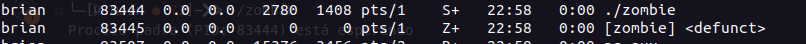

# Actividad 6 – Procesos e Hilos

## Problema 1

*¿Incluyendo el proceso inicial, cuantos procesos son creados por el siguiente programa?
Razone su respuesta.*

```c
#include <stdio.h>
#include <unistd.h>

int main() 
{
    /* fork a child process */
    fork();

    /* fork another child process */
    fork();

    /* and fork another */
    fork();

    return 0;
}
```

## Respuesta:
*Se utiliza la llamada al sistema `fork()` en C para crear procesos en donde cada llamada a `fork()` crea un nuevo proceso hijo que es una copia del proceso que lo llamó.*

*Para calcular el numero de Procesos:*

*Después del primer fork(): 2 procesos (1 inicial + 1 nuevo)*

*Después del segundo fork(): Cada uno de los 2 procesos crea un nuevo proceso, resultando en 4 procesos en total.*

*Después del tercer fork(): Cada uno de los 4 procesos crea un nuevo proceso, resultando en 8 procesos en total.
El proceso inicial se cuenta como uno de los 8 procesos en total.*

*Por lo tanto, el programa crea 8 procesos en total (incluyendo el proceso original).*

## Problema 2

*Utilizando un sistema Linux, escriba un programa en C que cree un proceso hijo (fork) 
que finalmente se convierta en un proceso zombie. Este proceso zombie debe 
permanecer en el sistema durante al menos 60 segundos.*

*Los estados del proceso se pueden obtener del comando: ps -l*

## Respuesta



## Problema 3

*Usando el siguiente código como referencia, completar el programa para que sea 
ejecutable y responder las siguientes preguntas:*

- *¿Cuántos procesos únicos son creados?*
- *¿Cuántos hilos únicos son creados*

```c
    pid_t pid;

    pid = fork()
    if (pid == 0) { /* child process */
        fork();
        thread_create(...);
    }
    fork();
```

## Respuesta 

```c
#include <stdio.h>
#include <stdlib.h>
#include <unistd.h>
#include <pthread.h>

// Función que se ejecutará en el hilo
void *thread_function(void *arg) {
    printf("Hilo (PID: %d, TID: %lu) está ejecutando\n", getpid(), pthread_self());
    pthread_exit(NULL);
}

int main() {
    pid_t pid;

    // Primer fork
    pid = fork();

    if (pid < 0) {
        perror("fork");
        exit(EXIT_FAILURE);
    }

    if (pid == 0) { /* Proceso hijo */
        // Segundo fork en el proceso hijo
        fork();

        // Crear un hilo en el proceso hijo
        pthread_t thread_id;
        if (pthread_create(&thread_id, NULL, thread_function, NULL) != 0) {
            perror("pthread_create");
            exit(EXIT_FAILURE);
        }

        // Esperar a que el hilo termine
        pthread_join(thread_id, NULL);
    }

    // Tercer fork en el proceso padre y en el proceso hijo (si es que hay un proceso hijo)
    fork();

    // Esperar un poco para ver los procesos e hilos creados
    sleep(10);

    return 0;
}
```

*Para calcular el número total de procesos únicos:*

*Inicio:*

- *1 proceso inicial (P0)*

*Después del primer `fork()`:*

- *2 procesos en total (P0 y P1)*

*Después del segundo `fork()` en el proceso hijo (P1):*

- *3 procesos en total (P0, P1, y P2)*

*Después del tercer `fork()` en todos los procesos actuales:*

- *Cada uno de los 3 procesos actuales (P0, P1, P2) realiza un nuevo `fork()`, creando 3 procesos adicionales.*
- *6 procesos en total (P0, P1, P2, P3, P4, y P5)*

*En resumen, 6 procesos únicos son creados.*

***Número total de procesos únicos creados: 6***

***Número total de hilos únicos creados: 1***