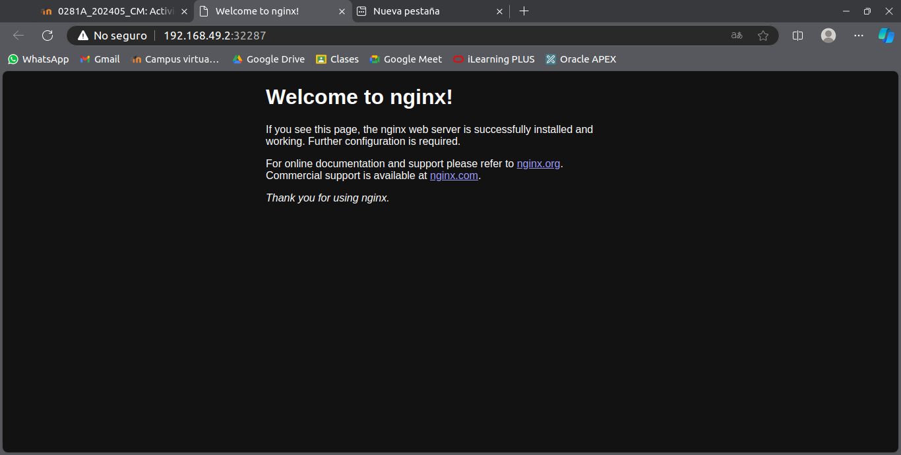

# *Actividad 8 - Primeros pasos con K8s*

## *Paso 1: Instalar un ambiente local de Kubernetes utlizando minikube* 

***Instalar dependencias***

*Instala las siguientes herramientas si no las tienes ya en tu sistema:*

-  *kubectl (herramienta de línea de comandos para Kubernetes)*

    - *Kubectl es necesario para interactuar con tu clúster Kubernetes.*

```bash
curl -LO "https://dl.k8s.io/release/$(curl -L -s https://dl.k8s.io/release/stable.txt)/bin/linux/amd64/kubectl"
sudo install -o root -g root -m 0755 kubectl /usr/local/bin/kubectl
```

*Verifica que kubectl esté instalado correctamente:*

```bash
kubectl version --client
```

*Descarga e instala Minikube:*

```bash
curl -LO https://storage.googleapis.com/minikube/releases/latest/minikube-linux-amd64
sudo install minikube-linux-amd64 /usr/local/bin/minikube
```


*Verifica que esté instalado correctamente:*

```bash
minikube version
```

*Iniciar Minikube*

```bash
minikube start
```

## *Paso 2: Desplegar un contenedor de algun web server, apache o nginx por ejemplo, en el Cluster de K8s Local.*

- ***Crear un Pod con un contenedor***

    - *Un Pod es la unidad básica de ejecución en Kubernetes. Puedes crear un Pod que contenga un contenedor ejecutando cualquier aplicación.*

    *Para crear un Pod que ejecute un contenedor de Nginx, puedes usar el siguiente comando:*

    ```bash
    kubectl run nginx --image=nginx --port=80
    ```

    *Este comando hará lo siguiente:*

    - *Crea un Pod llamado nginx.*

    - *Usa la imagen de Docker oficial de Nginx.*

    - *Expone el puerto 80 para el contenedor.*
    
    *Para verificar que el Pod fue creado y está en ejecución, usa:*

    ```bash
    kubectl get pods
    ```

- ***Crear un Deployment (opcional, recomendado)***

    - *Si deseas un despliegue más avanzado que te permita replicar y manejar actualizaciones de tu aplicación, es recomendable usar un Deployment en lugar de un Pod. Un Deployment gestiona los Pods y puede realizar réplicas y actualizaciones de forma más segura.*
    
    *Para crear un Deployment de Nginx, puedes usar el siguiente comando:*

    ```bash
    kubectl create deployment nginx --image=nginx
    ```

    *Para verificar que el Deployment fue creado correctamente:*

    ```bash
    kubectl get deployments
    ```

- ***Exponer el servicio (Service)***

    - *Por defecto, los Pods no son accesibles desde fuera del clúster. Para acceder a la aplicación desde el exterior (por ejemplo, desde tu navegador), necesitas exponer un Service.*

    *Puedes exponer el servicio de Nginx usando el siguiente comando:*

    ```bash
    kubectl expose deployment nginx --type=NodePort --port=80
    ```

    *Esto hará que el servicio sea accesible a través de un puerto asignado en el nodo local. Para verificar el puerto asignado, usa:*

    ```bash
    kubectl get services
    ```

    *Esto mostrará el puerto asignado en el campo PORT(S). El puerto externo estará en el rango de `30000-32767`.*

- ***Acceder al contenedor (Minikube específico)***

    - *Si estás usando Minikube, puedes usar el siguiente comando para abrir el servicio en tu navegador:*

    ```bash
    minikube service nginx
    ```

    ***RESULTADO:***

    


- ***Eliminar el Deployment o el Pod***

    - *Para limpiar los recursos, puedes eliminar el Pod o el Deployment:*

    *Para eliminar un Pod:*

    ```bash
    kubectl delete pod nginx
    ```

    *Para eliminar un Deployment (lo que también eliminará los Pods asociados):*

    ```bash
    kubectl delete deployment nginx
    ```

    *Para eliminar el Service:*

    ```bash
    kubectl delete service nginx
    ```

# *¿En un ambiente local de Kubernetes existen los nodos masters y workers, como es que esto funciona?*

*En un entorno local como Minikube, la arquitectura de Kubernetes se adapta para funcionar en un solo nodo, combinando las funciones de maestro y trabajador. Esto permite a los desarrolladores y usuarios experimentar y probar aplicaciones en un clúster de Kubernetes de manera sencilla y eficiente en sus máquinas locales. Por lo que todo el clúster (nodo master y worker) se ejecuta en una sola máquina virtual, simulando ambos roles en un solo nodo. Minikube te permite desarrollar y probar con Kubernetes localmente sin la complejidad de un clúster distribuido.*
